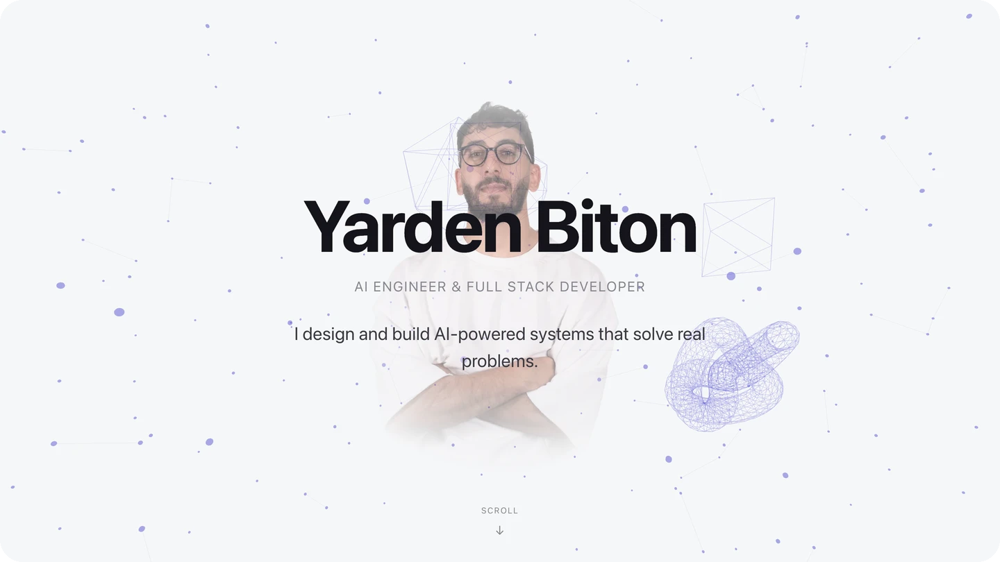

# Hi, I'm Yarden Biton 👋

### AI Engineer & Full Stack Developer

---

## About Me

I'm an Information Systems graduate (B.Sc.) from Yezreel Valley College in Israel.

I build full-stack apps with **React**, **TypeScript**, and **Python**, and I've been diving deeper into AI lately — things like agents, MCP servers, and LLM-powered tools.

I care about clean code, solid architecture, and shipping things that actually work. Background in OOP, data structures, QA, and system design.

Looking for my first role as an **Applied AI Engineer**.

- 🌱 Currently learning: Advanced Python, LangChain, system design, and cloud deployment
- 💬 Happy to chat about: AI agents, GenAI apps, Java, and testing
- 👨‍💻 My projects: [github.com/Jordan1881](https://github.com/Jordan1881)
- 📫 Email: **jordanstu21@gmail.com**

---

## GitHub Stats

  
  

 

  

 

  

---

## Featured Projects

| Project | Stack | Links |
| --- | --- | --- |
| **[Finlens](https://github.com/Jordan1881/Finlens)** — Bank statement AI analysis | TypeScript | [Repo](https://github.com/Jordan1881/Finlens) |
| **[Notesmith AI](https://github.com/Jordan1881/Notesmith-AI)** — AI note / GenAI tooling | Python | [Repo](https://github.com/Jordan1881/Notesmith-AI) |
| **[Questly](https://github.com/Jordan1881/Questly)** — Interactive web app | JavaScript | [Live](https://questly-gilt.vercel.app) · [Repo](https://github.com/Jordan1881/Questly) |
| **[Nati's Order Management](https://github.com/Jordan1881/Nati-s-)** — Production order system | TypeScript | [Live](https://natisordermanagement.vercel.app) · [Repo](https://github.com/Jordan1881/Nati-s-) |
| **[Portfolio](https://github.com/Jordan1881/portfolio_jordan)** — Personal site | TypeScript | [Live](https://portfoliojordan-liard.vercel.app) · [Repo](https://github.com/Jordan1881/portfolio_jordan) |
| **[ArtAffinity](https://github.com/Jordan1881/ArtAffinity)** — AI art marketplace | HTML / Full stack | [Repo](https://github.com/Jordan1881/ArtAffinity) |

---

## Languages & Tools

  
  
  
  
  
  
  
  
  
  
  
  
  
  
  
  

---

## Connect with Me

&nbsp;&nbsp;

&nbsp;&nbsp;

  

⭐️ From [Jordan1881](https://github.com/Jordan1881)

